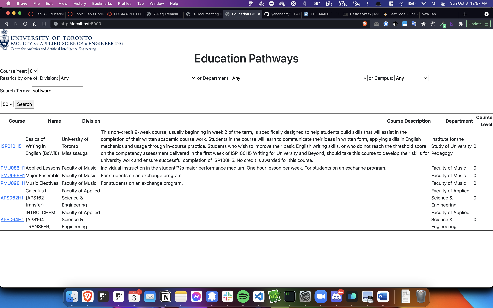

# CARTE Education Pathways - Yanchen Ma

This repo is a clone of https://github.com/nelaturuk/education_pathways

## Activity 1

## Activity 3

## Activity 4
  

## Activity 5

#### Functional Improvement
  Currently, search results do not seem reflect the search keywords. For example, if I enter the search term "software", these are the results I get:

  This is a functional requirement since students will expect relevant search results when they search for courses they want to take. The improvement would be making sure that when a student searches a keyword, we return only the courses that are relevant to those keywords (or at least contain them).

#### Non-Functional
  Currently, the search results returned do not have good spacing between them. It is still possible to read the course descriptions, thus this is a non-functional requirement. The improvement would be adding more padding between individual course rows in the search results to make it easier to read.

## Description
  Welcome to CARTE's in-development tool for course selection at UofT. Education Pathways allows for more intelligent course searching, by matching not just the terms you search, but ones relevant to them. The more terms you search for, the more relevant your results will be! Even try searching across disciplines for the courses that best cover each.

  Whatever year you are looking for, Education Pathways will also suggest courses in earlier years that will best help you to prepare. To get the most out of this, try searching for courses in a later year and see what is suggested for your current one.

  We are looking for feedback to improve Education Pathways and make it more useful for students. If you have ideas or suggestions, please email us!

## Setup Instructions

### With Docker

## Repository files:

  `./Procfile ./wsgi.py` *tells gunicorn how to run the program*

  `./environment.yml  ./requirements.txt` *specifies python requirements for anaconda and pip respectively*

  `./__init__.py` *main flask code*

  `./readme.md` *this file*

  `./resources:` *contains datasets used in the program*

  `course_vectorizer.pickle df_processed.pickle`

  `course_vectors.npz       graph.pickle`

  `./static:` *contains any static elements of the webpage, in this case just the CARTE logo*
  `CARTE_logo.jpg`

  `./templates:` *contains flask templates for rendering HTML*

  `_formhelpers.html course.html       index.html        results.html`
